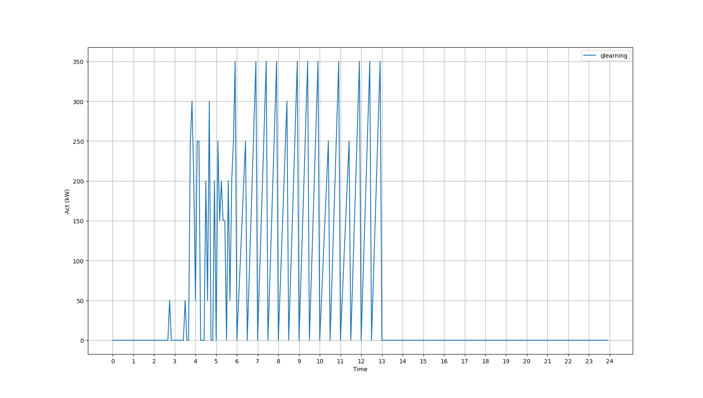
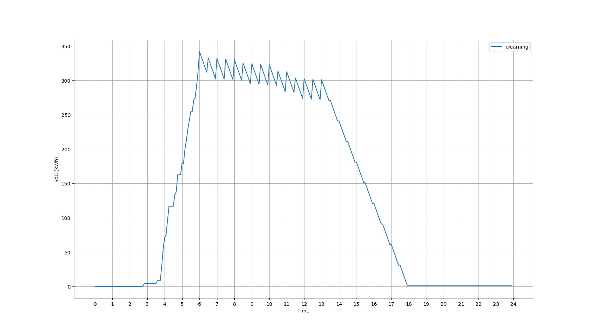
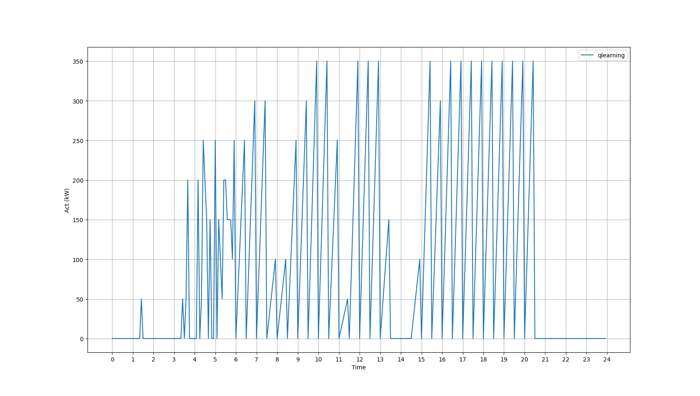
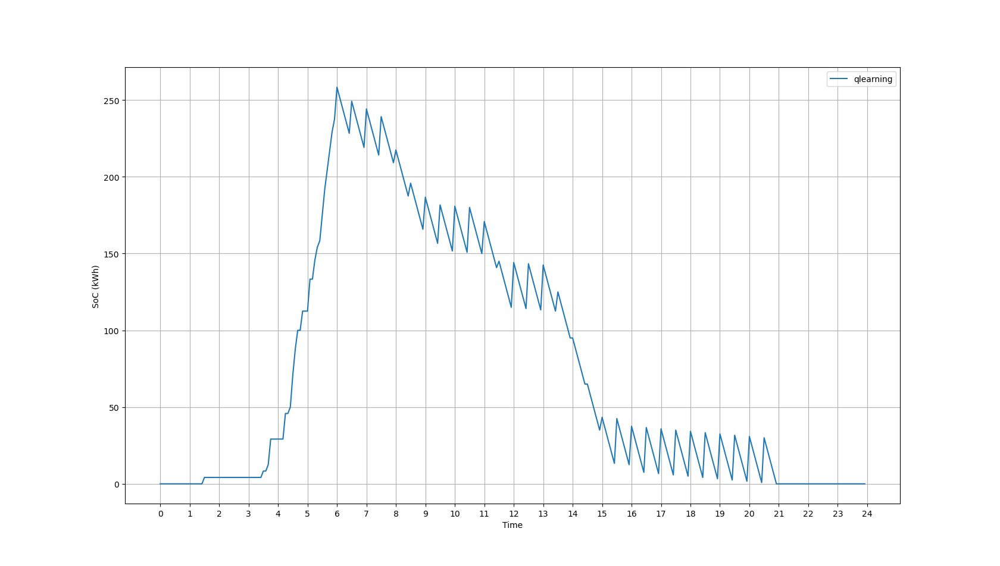

# Depot Charging Simulator

## Scenario
+ This scenario describes the working schedule at CVTD in Logan, UT.
+ The bus operates from 6 AM to 9 PM, while the remaining time is spent at the depot, allowing for charging.
+ During the operational period, the bus departs from the terminal at XX:00 or XX:30 and returns to the terminal at XX:25 and XX:55. In other words, there is a 5-minute gap between each trip when the bus stays at the terminal, providing an opportunity for charging.

## Settings
+ Maximal Battery Capacity: 350kWh
+ SoC for one trip: 30kWh (25 minutes)
+ Maximal Charging Capacity: 350kW
+ Price Schedule:
    + peak hours: 13:00 ~ 21:00
    + off-peak hours: All other hours
    + electricity charge rate (ec): $0.050209/kWh (peak hour), $0.033889/kWh (off peak hour)
    + demand charge rate (dc): $15.4/kW (peak hour), $0/kW (off peak hour). The demand is calculated as the average of the highest demand observed within a 15-minute time window. 

## Results:
+ Optimal:
  + the cost (ec+dc): $24.400079999999996
  + total reward: -24.400079999999996
  + success trips: 24

+ Q-learning:
  + the cost (ec+dc): $24.428320833333327
  + total reward: -24.428320833333327
  + success trips: 24

The 6 PM:

The 9 PM:

